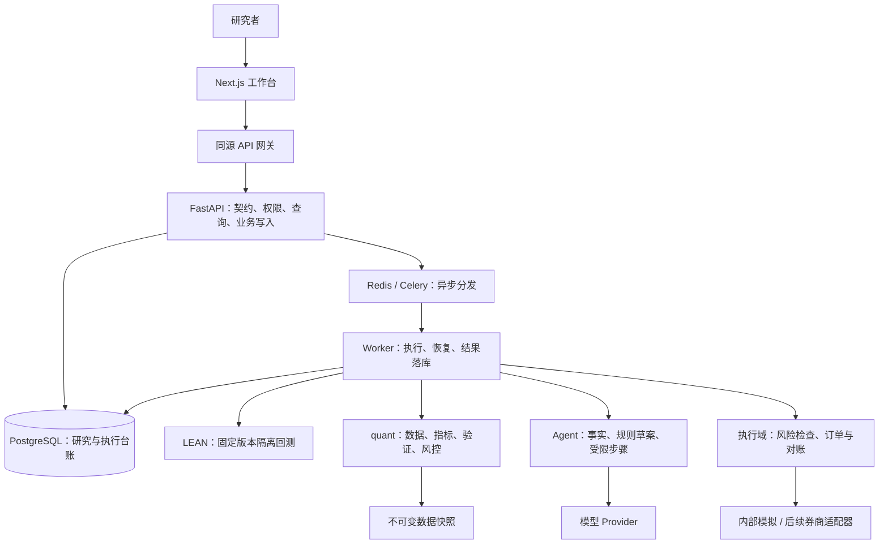

# Axiom Street · 量化工作台总规划

> 从假设出发，让证据说话。
>
> 更新：2026-09-14。本文是项目定位、现状、路线图、前后端设计和工程规范的唯一主文档。历史方案由 Git 保存，不再维护多份交接稿。
>
> 当前交付：文档归并、可信概览，以及 P1 验证与运行状态的首批修复。下一执行包：**P1.2b 策略列表分页与服务端筛选**；P1 尚未整体验收。标为待做或未完成的任务不代表已经实现。

**阅读顺序：** 了解产品看 1–3；安排开发看 4–7；准备账户与 Key 看 8；接手工程看 9–11。

## 1. 项目目标定位

**把 Axiom Street 打造成严肃个人研究者和小型研究团队的专业量化工作台：从一个投资假设，到可复现的研究证据，再到可监控、可追责的执行，在同一个清晰、漂亮的工作空间里完成。**

核心竞争力是四件事同时成立：**研究容易上手、数据和计算可信、验证无法绕过、执行始终受控。** “顶级”由这些能力的完成度来衡量，不以页面数量、模型数量或回测收益高低来衡量。

| 维度 | 产品选择 |
|---|---|
| 首要用户 | 有明确研究问题的个人研究者；支持规则构建，也允许专业用户接管 Python |
| 后续用户 | 需要共享研究、审查和分权操作的小型团队；完成权限和隔离后开放多人使用 |
| 第一市场 | 延续现有美股股票与 ETF、日线、中低频研究；新市场单独满足交易日历、数据和执行契约 |
| 核心路径 | 想法 → 规则 → 版本 → 数据快照 → 回测 → 验证 → 研究结论 → 模拟运行 → 受控实盘 |
| AI 角色 | 澄清假设、起草规则、解释证据、提出下一步；计算、状态晋级、风险限额由确定性系统控制 |
| 首版边界 | 先完成本地单用户可靠研究闭环；高频做市、策略商城、跟单和多市场同时铺开不进入本轮路线图 |

保留原项目关于可复现、试验留痕和独立风控的原则。调整旧文档排斥规则式操作的定位：不会写代码的人也应能建立明确、可审查的策略；系统必须帮助他理解交易规则和研究限制。

### 产品承诺

- 每个数字都能查到时间范围、来源、计算口径和证据记录。
- 每次实验留下记录；换版本、AI 生成和失败尝试不能成为隐藏搜索历史的途径。
- 数据缺失、能力不足、任务失败明确呈现；不能把未知写成零或通过。
- 同一代码、参数、快照、引擎、依赖和随机种子可以重放；变动形成新版本。
- 通过统计验证只表示满足已定义的研究规则，不保证未来收益，也不能自动换来实盘权限。

## 2. 成功的画面

### 研究者的一天

打开工作台，首先看到自己的研究、待处理任务和数据状态。首页清楚区分“数据过期”“实验失败”“验证不足”和“系统不可用”，点击即可进入对应问题。

输入一个想法，例如“用趋势过滤减少 ETF 下跌阶段的暴露”。系统帮助明确标的、观察窗口、仓位、退出条件、成交时间和成本；没有定义的地方直接列出来。用户先看懂规则，再决定是否展开代码。

确认规则后，系统锁定策略版本和数据快照，显示实验范围与预计资源消耗。实验在后台执行，关掉页面也不会丢失。回来能看到真实进度、日志、曲线、交易记录和相对基准的表现。

验证台回答“这份结果有多可靠”：样本外是否衰减、参数是否脆弱、成本是否吃掉收益、尝试了多少变体、数据还有什么局限。验证不通过时，用户能选择继续研究或写下放弃原因。

结论成立后生成一份别人能够审查的研究报告。策略先进入持续模拟运行，比较信号、目标仓位、订单和实际成交。具备完整运行证据并经人工批准后，才进入受限资金的实盘运行。

### 目标界面

```text
┌─────────────┬──────────────────────────────────────────────────────────┐
│ Axiom Street│ 全局搜索                         任务中心 · 连接状态      │
│             ├──────────────────────────────────────────────────────────┤
│ 概览        │ 研究标题 · 当前版本 · 数据时间 · 验证状态                 │
│ 策略研究    │ 一句话假设                         当前主操作            │
│ 回测分析    ├─────────────────────────────────┬────────────────────────┤
│ 稳健性验证  │ 规则 / 代码 / 结果 / 版本        │ 研究上下文             │
│             │                                 │ 缺失证据               │
│ 研究资料 ▾  │ 主要工作区域                    │ 下一步                 │
│ 交易工具 ▾  │ 图表、表格和编辑器按任务展开     │ 助手按需打开           │
│             ├─────────────────────────────────┴────────────────────────┤
│ 工作区设置  │ 作业状态 · 进度 · 可恢复操作                             │
└─────────────┴──────────────────────────────────────────────────────────┘
```

这是目标布局示意，不是已实现界面的截图。采用现有明亮的 Research Studio 风格，研究内容占主位，复杂功能按需展开。

### 可验收的成功标准

以下是建设目标，不是当前性能声明；P1 先记录硬件、数据规模和基线。

| 目标 | 验收方式 |
|---|---|
| 第一项研究容易完成 | 环境与数据就绪后，新用户 10 分钟内完成规则确认、版本保存与实验提交；执行耗时单列 |
| 结果可追溯 | 抽检的完成作业 100% 带版本、参数、快照、引擎和试验记录；报告可回到证据 |
| 可复现 | 固定输入重跑 Golden，净值逐点一致；数值容差按既有契约，不因失败放宽 |
| 统计不误导 | 超过一页仍准确统计；空值、零、过期值、失败四种状态可区分 |
| 长任务可靠 | 中断、超时、取消、重复投递、多 Worker 均有演练证据；无重复成交或丢失终态 |
| 使用流畅 | 约定测试机和数据集上，常用列表/摘要 API p95 ≤500ms，交互反馈 ≤200ms；排队与计算时间分别显示 |
| 界面完整 | 375/768/1440px 验收，页面无横向溢出；宽表格内部滚动；键盘完成核心操作 |
| 可持续运行 | 实盘前至少 30 个交易日模拟观察与故障演练；低频策略还须满足预先定义的事件覆盖要求 |

长期北极星指标是**研究预期与样本外、模拟和真实执行结果的偏差及其可解释程度**。偏差改善需要实测，不能用高回测次数或高通过率替代。

## 3. 当前已经完成什么

### 3.1 代码现状

下文简写的 `features/`、`components/`、`app/`、`lib/` 路径相对 `apps/web/src/`；其他代码路径相对仓库根目录。

本轮依据源码、配置和本地回归整理；“已有实现”不等同于完成真实行情、真实券商或生产部署验收。

| 模块 | 已有实现 | 明确边界 / 接手位置 |
|---|---|---|
| 产品外壳 | 浅色主题、桌面/移动导航、搜索、按业务拆分的页面 | `apps/web/src/components/layout`、`app/globals.css`；未完成全站无障碍认证 |
| 工作台概览 | 独立全库统计、状态分布、稳定排序的最近完成回测、摘要失败态与自动刷新 | `GET /api/v1/overview`、`features/home/use-overview.ts`；列表分页控件仍待补齐 |
| 策略研究 | 新建、编辑、版本保存/比较/恢复、语法与语言服务、运行入口；无引用草稿可删除，有研究/执行引用返回 409 保留证据 | `features/strategy-lab`、`services/api/services/strategies.py` |
| 规则构建 | 单标的均线趋势、50/100/200 日预设、仓位与成本、确定性生成代码、草稿应用检查 | `features/strategy-lab/guided-strategy.ts`；不反向解析任意 Python，不是通用策略生成器 |
| 回测分析 | Celery/LEAN 执行、进度、指标、净值、回撤、交易、比较与报告导出接口 | `quant/engine`、`services/worker/tasks/backtests.py`、`features/backtests`；依赖完整运行环境 |
| 数据底座 | 行情摄取、不可变快照、增量摄取、质量报告、双源对账、标的池有效期 | `quant/data`、`services/worker/tasks/data.py`；数据商权限和时点完整性需验收 |
| 验证底座 | 八项检验、最新失败/进行中覆盖旧成功、参考回测范围核对、旧版本回调隔离、扫描继承参考输入 | `quant/validation`、`quant/metrics`、`services/api/services/validation_spec.py`；参数扫描有算子限制 |
| 研究记录 | 实验台账、研究笔记和相关页面 | `experiment_trials`、`features/experiments`、`features/research` |
| 研究助手 | DeepSeek 适配、聚合事实解释、受限聊天、白名单建议和异步记录 | `services/agent`；未实现模型策略生成和可恢复多步自主研究 |
| 内部模拟交易 | 输入模拟价格的纸面下单、风险校验、现金/持仓/成交台账、幂等与对账基础 | `quant/execution/paper.py`、`services/worker/tasks/paper.py`；不是券商 Paper，也不是持续行情驱动执行 |
| 风控 | 纯风控规则、回测与纸面路径复用、风险摘要与阻断原因 | `quant/risk`、`features/risk`；实盘账户级风控及灾难演练尚未完成 |
| 组合 | 创建组合、服务端校验权重、提交单期收益、单期 Brinson 归因 | `quant/portfolio/attribution.py`、`features/portfolio`；没有完整多期归因或因子模型 |
| 运行观测 | 健康检查、Worker 心跳、沙箱配置检查、Prometheus、OTel、可选 Sentry | `services/api/health.py`、`services/worker/health.py`、`services/telemetry.py` |
| Live | 服务端 readiness 与拒绝激活守卫，前端规划页 | `services/api/routers/live.py` 明确 `LIVE_BROKER_IMPLEMENTED = False`；未接真实券商 |

### 3.2 本轮验证证据

2026-09-14，在当前工作区执行 `make test-all` 通过；P1.3c 家族试验代次交付后再次执行完整检查，最终结果：

- 后端：**567 项单元测试通过**；Ruff 检查和格式检查通过；mypy 检查 119 个源文件通过。
- 前端：**128 项测试通过**；TypeScript 检查通过；ESLint 无错误；生产构建通过。
- 仍有一个既有 LSP effect 清理告警，保留为 P1.4b；未通过屏蔽规则消除告警。
- 新增验收覆盖：137 条策略的全库计数、空库、列表外最新回测、零收益保留、新建/删除刷新、研究证据防误删、摘要失败隐藏缓存、最新失败/排队/运行覆盖旧成功、参考范围不一致、缺少快照/来源、缩短验证窗口、旧版本迟到回调、扫描参数继承、过期与未来心跳，以及 P1.3b 的扫描子回测执行核验（换镜像/换快照/非扰动轴改参/缺失子产物均拒绝）、Walk-Forward fold 执行证据缺失判过期、SPA 试验集合固定与跨快照拒绝，以及 P1.3c 的家族试验代次绑定（新增试验撤销 DSR/SPA 旧结论、Sharpe 更新同样过期 DSR、重算后恢复晋级、验证证据接口与前端证据状态卡）。
- `docker-compose --env-file .env.example config --format json` 解析通过，8 个发布端口均绑定 `127.0.0.1`。本机未安装 `docker compose` 子命令，独立 `docker-compose` 可用；Docker daemon 探测不可用。
- 本地现有 `.venv` 是 Python 3.9，测试通过不代表 Python 3.11 运行基线已验收。未改写现有环境或重启用户服务。
- 未执行真实 LEAN Golden、浏览器端到端、行情摄取、模型付费请求、Paper 下单或部署。真实研究链路仍须独立环境验收。

### 3.3 优先解决的差距

1. **扫描实际执行证据与家族试验代次已落地。** P1.3b 已交付：PBO/敏感性/成本从 `result.backtest_ids` 核对每个子回测的版本、快照、引擎、数据、窗口、基准、资金、标的池，非声明扰动轴变化一律拒绝，缺失子记录判 `scan_execution_missing`；Walk-Forward 每次 fold 留存 `result.execution`（引擎/数据版本、快照、范围、fold 列表），历史缺失判 `walk_forward_execution_missing` 不伪造元数据；SPA 固定 `params.family_id/data_snapshot_id/n_models` 与 `result.models` 试验集合，缺失或跨快照拒绝。P1.3c 已交付试验代次绑定（见下条）。`collect_validation_evidence` 与 Live readiness 共用同一核验，晋级与 readiness 一致。
2. **家族试验代次已绑定。** P1.3c 已交付：DSR 记录 `trial_set_hash`（试验、Sharpe 对的规范哈希），SPA 记录 `trial_set_hash` 与 `trial_candidate_ids`；证据核验在每次晋级与 readiness 时重算当前台账，不一致判 `dsr_trial_set_changed` / `spa_trial_set_changed` 并撤销 `VALIDATED`，重算后恢复。并发写入的竞争结果同样 fail-closed：后提交的旧代次在下一次核验时被拒绝。DSR 另有 `n_trials` 计数回退（生产行必有该字段）；无任何基线的历史行仅走范围核验，重跑即获得绑定。Live 真实券商开关继续关闭。
3. **运行版本与环境仍需验收。** Compose 地址、过期/未来心跳及 E2E Node 22 已修复；构建提交、迁移版本、Python 3.11、运行进程/源码一致性及真实 Golden 尚未验收。
4. **列表操作仍受分页限制。** 全库摘要已独立统计，首页最新完成回测也不再从前 50 条推算；策略列表仍加载前 100 条并在当前结果中搜索，需保留分页元数据并提供翻页和服务端筛选。
5. **恢复机制需要故障演练。** 已修复验证失败回调撤销晋级和旧版本回调串扰；多 Worker、重复投递、中断、取消以及数据库并发写入仍待集成验收。
6. **变量存在不等于已接通。** Alpaca、Alpha Vantage、Tiingo 在 provider 状态中均为 `wired=False`；配置 Key 不能补出适配器。

## 4. 后续六阶段路线图

不再延续历史 Phase 1.5/5/9 和 E6/P9 混用的编号。以下 P1–P6 是本次重新建立的路线图。

| 阶段 | 交付结果 | 前置条件 | 粗估工程量* |
|---|---|---|---|
| **P1 可靠性收口** | 当前代码可运行、摘要准确、验证证据可靠、故障可恢复 | 本轮整理完成 | 2–3 人周 |
| **P2 研究工作流成型** | 从想法到报告，统一交互和任务中心 | P1 验收 | 3–5 人周 |
| **P3 数据与验证深化** | 时点数据、可解释验证、多期组合研究 | P2 主路径稳定 | 4–6 人周 |
| **P4 AI 研究助手升级** | 规则草案、差异审查、受预算约束的可恢复研究步骤 | P3 证据与验证契约稳定 | 3–5 人周 |
| **P5 持续模拟交易** | 行情驱动运行、订单生命周期、执行偏差与独立风控 | P3；AI 可保持关闭 | 4–6 人周 + 观察期 |
| **P6 受控实盘与团队化** | 首家券商、权限隔离、审批、发布和运维闭环 | P5 通过；先完成 P6A 身份与权限 | 5–8 人周 + 外部接入周期 |

*用于拆分预算的初估，合计 21–33 人周，不是交付日期。P1 结束按真实技术债重估；账户资格、数据授权和模拟观察期不能用加人抵消。默认顺序实施；P4 并非 P5 的执行依赖，AI 成本或效果不合适时可以推迟。

### P1 · 可靠性收口

**交付：别人拿到仓库，能理解配置、确认运行版本，并跑完一条可信研究链路。**

| 包 | 前端交付 | 后端 / 工程任务 | 验收 |
|---|---|---|---|
| P1.1 运行基线 | 设置页区分 API 在线、Worker 可执行、数据可用、模型可用 | 定位进程/端口/目录/镜像，加入构建和迁移版本；本地 Compose 发布端口限制为 `127.0.0.1`；核验健康降级语义 | 运行实例与源码匹配；Worker 失联不显示“可回测”；独立环境完成真实 Golden |
| P1.2 可信概览 | 概览与策略摘要读取独立 totals；空态和错误态分开 | 新建 overview 聚合；保留列表分页元数据；统一更新时间 | 库内 137 条、列表 100 条时总数仍为 137；新增/删除/终态后刷新 |
| P1.3 证据有效性 | 验证展示版本、快照、参数范围及过期原因 | 汇总绑定完整研究范围；核验新增试验、最新失败、换版本/快照后的失效；检查 Live readiness 旧成功掩盖新失败 | 旧版本成功、不同快照、旧试验批次不能给当前研究错误通行证 |
| P1.4 作业恢复与告警 | 失败说明、重新运行入口、取消真实终态 | 演练超时/中断/重复投递/多 Worker；只修已证实缺口；验证 LSP 清理并消除 lint 告警 | 不重复记成交/扣款/回复；取消终止实际进程；活跃任务不被误回收 |

**主要落点：** `services/api/health.py`、`services/worker/health.py`、`services/worker/celery_app.py`、`services/api/services/validation.py`、`services/api/routers/live.py`、`docker-compose.yml`、`Makefile`、`apps/web/src/features/home`、`features/settings`、`features/strategy-lab`。

**新增接口和文件：** `GET /api/v1/overview`；`services/api/services/overview.py`、`services/api/routers/overview.py`、`tests/unit/test_overview_api.py`、`apps/web/src/lib/api/overview.ts`。字段至少有 `strategy_count`、`strategy_counts_by_status`、`latest_completed_backtest`、`as_of`。最新记录采用稳定排序，空结果返回明确空值。

**Key：** 不新增付费 Key；Golden 使用具有合法权限且满足测试要求的数据。双源测试缺少 `POLYGON_API_KEY` 时记录为未验收，不算通过。

### P2 · 研究工作流成型

**交付：用户知道自己在哪里、刚刚完成了什么、下一步为什么值得做。**

| 包 | 前端交付 | 后端任务 | 验收 |
|---|---|---|---|
| P2.1 策略工作区 | 规则、代码、结果、版本采用稳定结构；新手/专业模式共享同一版本 | 版本化规则 schema；草稿与正式版本分离；基于源版本/代码哈希检测冲突 | 改仓位影响代码；0 成本保留；覆盖自定义代码前显示差异；过期草稿不能覆盖新版本 |
| P2.2 任务中心 | 统一任务抽屉，排队/运行/取消/失败可回看；跨页保留上下文 | 统一任务读模型，映射摄取/回测/验证/助手作业；持久化进度和关联 ID | 关页重开可恢复；网络重连不重提；取消语义明确 |
| P2.3 结果与比较 | 结论摘要 → 可信度 → 净值/风险 → 交易；比较 2–4 次实验 | 返回比较资格和版本、日期、基准、快照、成本差异 | 不同币种/时间范围不冒充同口径排名；图表与导出一致 |
| P2.4 研究报告 | 假设、方法、证据、限制、结论统一编辑；标识 AI 起草段落 | 笔记关联版本/运行/验证；导出固定证据清单和时间；复用现有导出能力 | 第三人凭报告可找到输入结果；新研究不悄悄改写旧导出 |

**主要落点：** `apps/web/src/features/strategy-lab`、`features/backtests`、`features/validation`、`features/research`；新建 `features/tasks` 与 API 客户端；`services/api/routers/research.py`、`services/api/services/tearsheet_export.py`；规则 schema/编译放 `quant/strategy_sdk`，HTTP 适配在 API。

**拟新增契约：** `GET /api/v1/tasks`、`GET /api/v1/tasks/{id}`、`POST /api/v1/tasks/{id}/cancel`，适配已有任务系统，不重建第二套执行引擎。持久化变化附 Alembic 迁移。

**Key：** 无新增；规则构建在无模型时完整可用。

### P3 · 数据与验证深化

**交付：每条研究证据有适用条件、有范围、有解释。**

| 包 | 前端交付 | 后端 / 量化任务 | 验收 |
|---|---|---|---|
| P3.1 数据目录 | 来源、覆盖、频率、时区、复权、缺口、授权能力统一查看 | 核验 Polygon 适配器与现行 API；能力探测与限速；快照血缘、校验、修订记录 | 价格/分红/拆分权限分别探测；401/403/限流/缺数有可行动原因 |
| P3.2 时点与回测正确性 | 研究前显示成分有效期和历史数据限制 | 停牌/退市/更名、日历、成交时点、基本面可用时点专项测试；不以当前成分回填历史 | 分红/拆分/退市/信号成交错位的固定案例和 Golden 通过；未知有效期明确标记 |
| P3.3 统一验证工作区 | 八项检验显示适用条件、样本数、失败原因；整组计划与资源估计 | 类型化注册表；冻结样本外区间、验证范围与试验代次；扩展扫描前声明支持算子 | 样本不足、参数未被读取、等同曲线不算通过；失败和不适用可解释 |
| P3.4 组合研究 | 组合收益、相关性、集中度、风险贡献、多期归因 | 延续单期 Brinson；一致估值时点与多期收益链接；因子回归记录模型/来源/频率 | 权重收益对齐，归因残差可解释；无因子数据不展示虚构暴露 |

**主要落点：** `quant/data`、`quant/metrics`、`quant/validation`、`quant/portfolio`、`services/api/services/validation_spec.py`、`features/settings`、`features/universes`、`features/validation`、`features/portfolio`。

**数据契约：** 每次实验记录策略/代码哈希、参数、快照、标的池时点、基准、费用/滑点、引擎版本、指标版本和随机种子；供应商修订只能生成新快照。

**Key：** 准备 `POLYGON_API_KEY` 和匹配的数据权限；因子/宏观等扩展数据先定覆盖与时点要求，再选供应商，不预先购买重复订阅。

### P4 · AI 研究助手升级

**交付：AI 帮用户完成明确的研究步骤，每一步可审查、可暂停、有预算。**

| 包 | 前端交付 | 后端 / Agent 任务 | 验收 |
|---|---|---|---|
| P4.1 意图与规则草案 | 对话澄清，区分用户定义和模型补充 | 意图解析、规则 schema、能力校验、确定性编译；不支持语义明确返回 | 不静默补杠杆、做空、退出和风险定义；无模型保留规则工作区 |
| P4.2 变更审查 | 原规则 → 新规则，可展开代码差异；显示出站数据范围 | 独立生成契约和授权范围；语法/依赖/未来数据引用检查；版本冲突检查；隔离执行 | 未确认草稿不写正式版本；旧 Copilot 不默认扩大为外发源码 |
| P4.3 有界研究运行 | 步骤、证据、预算、费用、等待用户决策点 | 持久化 `research_runs`/`research_steps`；幂等步骤、检查点、超时、试验/费用/时长上限、暂停恢复 | 重启从检查点恢复；预算到达停止新增请求；真实试验计入台账 |
| P4.4 结果解释与评测 | 结论引用实际回测/验证 ID；观察与推测分开 | 引用校验、提示词版本、输出校验；固定评测集覆盖缺证据、注入、幻觉、过期数据 | 不捏造收益和通过状态；模型投票不能改闸门；评测不过保持旧能力 |

**主要落点：** `services/agent` 按职责新增规则草案、计划和证据处理；`services/api/routers/copilot.py` 与独立研究运行路由；`services/worker/tasks/copilot.py`；前端规则审查在 `features/strategy-lab`，进度接 P2 任务中心。

**权限边界：** 当前 Copilot 继续只发送聚合事实，不发送源码、配置和原始行情。代码生成请求必须有独立出站范围和可审查说明。Agent 不能写风险限额、宣布验证通过或直接操作券商。静态检查不宣称能够证明任意 Python 安全或消除全部前视偏差。

**Key：** 复用 `STREET_DEEPSEEK_API_KEY`；先验收一个模型。其他 Provider 只有评测证明需要并完成适配后才增加 Key。

### P5 · 持续模拟交易

**交付：策略随市场数据持续运行，解释研究预期与执行结果为什么不同。**

| 包 | 前端交付 | 后端 / 执行任务 | 验收 |
|---|---|---|---|
| P5.1 市场时钟与信号 | 模拟会话、数据时间、信号与目标仓位 | 交易日历调度；行情过期阻断；冻结部署版本；信号转换为订单意图 | 重启/重复 bar 不重复下单；迟到/修订数据有明确政策 |
| P5.2 订单生命周期 | 待提交、接收、部分成交、撤单、拒绝、未知状态 | Broker 边界；幂等键、事件流、重复/乱序处理；内部模拟与券商 Paper 分环境 | 超时先查询对账再重试；现金/持仓/成交可重建 |
| P5.3 持续风控与对账 | 风险事件、限额、暂停开仓、偏差分解 | 账户级持久风险状态；单笔/单标的/总敞口/日损失限额；独立 kill switch；信号→订单→成交→持仓对账 | 过期、越限、断线、未知订单阻断新增风险；暂停不等于自动平仓 |
| P5.4 模拟观察 | 每日偏差、费用/滑点归因、异常记录 | 保存运行报告和演练证据；比较回测、持续模拟、券商回报 | 至少 30 交易日并覆盖预定义事件；无未解释账差；低频无成交不算充分验证 |

**主要落点：** `quant/execution` 增加调度/订单/Broker 接口；延续 `services/worker/tasks/paper.py`；`quant/risk` 状态由服务层加载保存；`features/paper`、`features/risk`、`features/portfolio`。

**Key：** 内部模拟无需券商 Key。若接 Alpaca Paper，再准备专属 Paper Key/Secret；先完成适配器和注入测试。账户与行情授权不足时仍可完成内部模拟，但不得声称券商验收通过。

### P6 · 受控实盘与团队化

**交付：有清晰权限、运行证据、资金边界和退出方式的正式工作台。**

| 包 | 前端交付 | 后端 / 运维任务 | 验收 |
|---|---|---|---|
| P6A 身份与隔离 | 登录、工作区、研究者/审查者/操作者/管理员、审计记录 | workspace 归属贯穿查询、写入、作业、文件、导出和事件流；服务端密钥管理；会话/权限检查 | 跨工作区 ID、后台作业、导出、SSE 均不能越权；后端拒绝无权限操作 |
| P6B 券商与准备度 | 凭据状态、账户权限、部署版本、证据有效期、待批准变更 | 首先接一家满足账户资格的 Broker；订单/成交/资产同步；Paper/Live 强隔离；证据失效阻断 | 旧成功不能覆盖新失败；错误账户/环境在网络调用前拒绝；变更重新审查 |
| P6C 受限实盘 | 资金上限、人工批准、运行控制、异常处理 | 独立风控、未知订单恢复、对账、紧急停止与分阶段放量 | 真实资金前单独取得明确授权；演练完整；小额运行后按证据扩大 |
| P6D 正式交付 | 面向当前任务的帮助、团队报告和版本说明 | TLS、备份恢复、迁移/回滚、错误告警、依赖/许可审查、容量记录 | 干净环境恢复 DB+快照+作业证据；实测恢复时间和数据损失窗口；发布可回滚 |

**主要落点：** `services/api` 权限依赖、模型和迁移；`services/worker` 任务归属与执行环境；`quant/execution` Broker；`features/settings`、新增 `features/live`、`features/risk`；`infra`、`.github/workflows`。

**Key：** 券商实盘凭据、身份服务配置、托管 DB/对象存储和告警凭据随方案配置。变量名随适配器落地定义，不假定所有服务都通过一个 API Key 工作。

## 5. 前端详细规划与界面规范

### 5.1 信息架构

保留四个主要入口：概览、策略研究、回测分析、稳健性验证。研究资料收纳标的池、实验比较、研究笔记；交易工具收纳模拟、组合、风控、实盘。设置集中管理数据、连接和运行状态。详情页可直达，刷新后保留上下文。

| 页面 | 主要问题 | 页面主操作 | 关键状态 |
|---|---|---|---|
| 概览 | 今天处理哪项研究或异常？ | 继续 / 新建研究 | 统计范围、更新时间、阻断项 |
| 策略工作区 | 规则是什么，版本如何变化？ | 保存 / 运行实验 | 未应用草稿、冲突、数据不足 |
| 回测分析 | 与基准如何，风险和成本是什么？ | 比较 / 发起验证 | 加载、失败、完成、来源不兼容 |
| 验证工作区 | 证据是否足够？ | 运行缺失检验 / 查看原因 | 未运行、不适用、不通过、过期、通过 |
| 数据与标的池 | 数据覆盖研究吗？ | 摄取 / 更新 / 检查问题 | 权限、时点、复权、质量问题 |
| 研究报告 | 为什么继续或放弃？ | 保存结论 / 导出 | 草稿、证据失效、固定导出 |
| 模拟与实盘 | 在运行什么，是否偏离？ | 运行控制 / 处理异常 | 环境、账户、新鲜度、订单未知态 |
| 设置 | 哪项依赖不可用？ | 检查连接 / 查看修复方法 | 未配置、无权限、不可达、过期 |

### 5.2 视觉基线

延续 `apps/web/src/app/globals.css` 的浅色方案。该文件是运行时令牌来源；本节约束设计意图与验收。两者同步更新，不再另建 MASTER 文档。

| 项目 | 统一规范 |
|---|---|
| 色彩 | 内容 `#ffffff`；画布 `#f5f5f7`；正文 `#1d1d1f`；次文字 `#6e6e73`；主操作 `#0066cc` |
| 状态色 | 正向 `#207e50`；负向 `#c1363d`；警告使用既有令牌；盈亏同时显示正负号和文字 |
| 摘要 | 浅蓝 `#f7faff`、边框 `#e2ebf8`；每页一个核心摘要，不铺满装饰卡片 |
| 字体 | 系统字体；财务数字等宽及 `tabular-nums`；正文 14–16px，关键内容不小于 12px |
| 留白 | 4/8px 基础；桌面区块间 32px、内容内距约 28px；手机水平边距 20–24px |
| 圆角 | 控件 12px、面板 20px、摘要 24px；业务页面不自行发明新规格 |
| 导航 | 桌面约 208px，可收为 68px；小于 768px 用移动导航 |
| 图标 | 沿用 Lucide，线宽 1.65；按名称导入；纯图标按钮有名称及至少 44px 触控区域 |
| 图表 | 读取 `lib/chart-tokens.ts`；单位/区间/基准/来源明确；真实曲线，支持精确值查看 |
| 动效 | 仅用于状态和层级变化，常规 120–200ms；支持减少动画；不阻塞操作 |

不用霓虹、紫色渐变、发光收益线、装饰性机器人、大面积深色宣传摘要。玻璃仅用于必要浮层与顶栏。保留 `brand/logo.png` 和 `apps/web/public/axiom-mark.svg`；不重画互相矛盾的标志；遵循 `NOTICE` 图表署名。

### 5.3 交互与实现要求

- 每页一个清晰主操作；危险操作说明影响；保存、运行、取消有进行中反馈和防重复提交。
- 草稿、保存版本、运行所用版本明确区分；切换专业模式不丢输入。
- `app/` 做路由组装；`features/` 放业务视图与 hooks；`components/ui` 放通用交互；`components/charts` 负责图表呈现。
- API 经 `lib/api` 和 React Query；保留分页总量，不用数组推算全库指标。格式化不能重新定义收益、归因或风控口径。
- 表单先给必要项，参数按需展开；标签、单位、范围、默认值、字段级错误齐全；筛选可恢复。
- 列表支持搜索/过滤/排序/分页；确有规模后引入虚拟化；批量操作逐项报告，不掩盖局部失败。
- 弹层限制焦点、支持 Escape、关闭后归还焦点；核心操作可键盘完成；普通正文对比目标至少 4.5:1，不仅靠颜色表达状态。
- 请求失败可显示标注“过期”的最后成功数据，不能继续称其为实时；空、错、加载、权限不足分别设计。
- 图表/Monaco 按需加载，基于实测优化。中文为主，文案归入 locale；不能仅凭有英文文件宣称全量国际化完成。

## 6. 后端详细规划与系统契约

### 6.1 目标分层



多步 Agent、完整权限与外部券商属于目标能力；现状见第 3 节。

| 领域 | 职责 | 不允许承担 |
|---|---|---|
| API | 契约/权限/存在性、短事务、分页/聚合、入队 | HTTP 请求内回测、持有 Docker socket |
| Worker | 执行、进度、取消、恢复、台账落库 | 假定“至少投递一次”意味着副作用只发生一次 |
| quant | 独立测试的数据、指标、验证、组合、风控算法 | import FastAPI/Celery、读取浏览器状态 |
| Agent | Provider、提示词、证据引用、受限研究步骤 | 改验证结论、风险上限、绕过执行域 |
| Execution | 订单意图、风险闸门、Broker 契约、对账 | 把 Broker SDK 暴露到策略代码中 |
| 存储 | PostgreSQL 保存关系/状态/台账；Parquet/快照保存序列 | Redis 成为唯一研究事实存储；模型回复成为指标来源 |

保留当前栈：Next.js 15 / React 19 / TypeScript、FastAPI / SQLAlchemy / Alembic、PostgreSQL、Celery / Redis、LEAN、pandas / NumPy / Parquet。版本以清单和锁文件为准，不强行升级。旧文档提到 DuckDB，但当前依赖未声明，不列为已使用能力。

### 6.2 API 契约与数据所有权

- 浏览器默认 `/api/backend`，Next.js 用运行时 `API_BASE_URL` 转发 `/api/v1` 或健康接口。内部地址和 Key 不进入浏览器包。
- 网关保留方法、查询、状态、下载类型/文件名、Request ID、SSE；不缓冲完整事件流后才返回。
- 新响应有 schema 并生成 TypeScript 类型。完善 CI：源码导出 OpenAPI → 快照比较 → 类型生成比较，覆盖源头漂移。
- 分页提供 `items/total/limit/offset` 或版本化 cursor 契约；总量服务端计算，跨页统计独立聚合。
- 时间落库/计算统一 UTC，另记录市场时区与日历；无时区历史值按现有 UTC 约定兼容。执行账本明确金额、数量、价格精度与舍入政策。
- 错误逐步统一为 `code/message/request_id/retryable`；堆栈留服务端，不回显凭据和内部连接串。
- 按业务定义幂等键；版本编辑用预期版本或哈希检测冲突并返回 409；读写重试分别设计。

### 6.3 实体演进

| 当前资产 | 后续建设 | 阶段 |
|---|---|---|
| strategies / strategy_versions | 规则版本、草稿基线、代码/参数哈希、部署冻结引用 | P2 / P5 |
| data_snapshots / universes / universe_members | 能力与授权描述、时点完整性、修订与质量追踪 | P3 |
| backtests / experiment_trials / validation_runs | 运行指纹、证据失效、试验代次、任务归属和恢复 | P1 / P3 |
| research_notes 与现有导出 | 固定证据引用、决策、报告 manifest | P2 |
| Copilot 台账 | 研究运行/步骤/预算/授权范围；保留只读能力 | P4 |
| paper_* | 信号、订单意图、Broker 事件、持久风险状态、持续对账 | P5 |
| portfolios / portfolio_allocations / portfolio_attributions | 估值序列、多期归因、有来源/模型版本的因子结果 | P3 |
| users / audit_logs | 真实身份、workspace、角色、审批和审计保护 | P6A |

Schema 演进附迁移、既有数据回填政策与回滚方式。不删除试验历史改善 DSR；重复投递的技术事件与独立研究尝试必须区分，计数规则由测试固定。

### 6.4 异步、可复现与运行要求

- 长任务由服务端状态机控制，记录排队/开始/结束、owner、heartbeat、attempt、error；有限重试前核验副作用。
- 处理数据库落单与队列发布的丢失窗口；故障测试后决定事务 outbox 或持久作业扫描补发，不先引入多套队列。
- 恢复以所属 Worker/心跳判断，不在任意 Worker 启动时把全部 running 改为失败。
- LEAN 固定镜像、只读数据、无网络、非 root、限制权限和资源；取消终止真实容器；Docker 权限仅给执行服务。
- 复现身份含代码、参数、快照、引擎、计算版本、随机种子；缓存键覆盖全部影响因素，命中保留原证据出处。
- 摄取不覆盖旧快照；双源 close 偏差 >10bps 为 warning，分红/拆分冲突阻断；修订生成新快照并保留血缘。
- 现有摄取默认上限 500 标的、2 请求/秒、并发 4，供应商实际限额优先；定期对账默认 86400 秒；字段和权限分别核验。
- DB、快照、作业产物协同备份；清理前检查引用，不因“整理工程”删除可复现证据。

## 7. 统计验证规范

合并旧闸门文档，描述现有算法和产品阈值，不承诺投资收益。核验入口：`services/api/services/validation_spec.py`、`services/api/services/validation.py`、`quant/validation`、`quant/metrics`；修改同步代码、测试和本文。

| 检验 | 当前规则 | 重要边界 |
|---|---|---|
| Walk-Forward | Anchored/Rolling；拼接 OOS 收益算 Sharpe；IS Sharpe 均值 >0.5 且拼接 OOS Sharpe <0 判塌缩 | “通过”仅表示未触发该塌缩规则，不代表显著获利；不以各 fold Sharpe 均值替代 |
| DSR | ≥0.95 通过；依据家族/快照的试验统计、长度、偏度/峰度等计算 | 模型假设下的统计量，不能写成“策略为真的概率”；计数和新鲜度须核验 |
| PBO / CSCV | ≤0.5；选能整除样本数的最大偶数分块数，候选 16/14/12/10/8/6/4，每块至少 10 日 | 不丢日凑分块；当前要求实际读取 `lookback`、2–12 互异值；等同曲线拒绝 |
| 敏感性 | 峰值附近连续至少 3 点在 0.5 Sharpe 带宽内判高原 | 产品规则；现为一维 lookback 扰动，不是通用多维优化器 |
| 成本 | 网格含 0bps；用 `alpha_capm` 插值临界成本，须大于真实成本基线（默认 5bps） | 成本扫描计入 `slippage_bps` 且 `fee_usd=0`；策略必须读取滑点参数 |
| Bootstrap | Stationary bootstrap；Sharpe/CAGR/MaxDD 的 95% 区间，Sharpe 下界 >0 | 至少 252 交易日；不用 iid 替代；短窗扫描不自动写全样本检验 |
| Regime | 牛熊用基准 20% 峰谷；21 日波动与样本中位数比较；利率周期按生效日；互补制度 Sharpe 不得为负 | 各轴至少 60 日；2008/2020-03/2022 压力窗口只报告；缺基准不以策略曲线替代 |
| Hansen SPA | 联合 stationary bootstrap，SPA_c 的 p<0.05 且统计量 T>0 | 至少 2 条可区分试验和 252 共同交易日；超过 64 条不截断；手动触发但仍为必需闸门 |

**纠正旧口径：** `validated_kinds()` 包含全部八项，SPA 未运行不会豁免。DSR、Bootstrap、Regime 有回测后自动计算路径，其余按任务触发。

晋级与 Live readiness 共用 `validation_evidence.py`：只评估当前策略版本，各类取最新记录（包含失败、排队、运行），检查已完成、`passed` 且无错误；以 DSR 引用的完整回测为参考，核对版本、快照存在性、日期、基准、资金、参数、标的池、引擎和数据版本，以及显式验证窗口。缺失或不一致则拒绝采用旧成功。全部满足才设 `VALIDATED`；新验证排队或失败重新汇总后可降回 `BACKTESTED`。旧版本回调不改变当前版本状态，客户端不可直接晋级。

**已实现参考回测一致性、扫描执行链证明与试验代次绑定。** PBO/敏感性/成本新任务继承参考快照、参数、标的池、基准和资金；实际子回测、Walk-Forward folds、SPA 试验集合按 P1.3b 验收，新增家族试验代次按 P1.3c 验收。后端 readiness 的 `evidence.validation_reasons` 和 `validation_backtest_id` 提供拒绝原因与参考 ID；验证台的证据状态卡已接入同一口径（`GET /api/v1/validation/evidence`）。

Golden 的 SPY 200DMA 基线沿用收盘产生信号、下一 bar 成交、5bps 滑点、1 美元固定手续费。指标由 Axiom 基于真实序列计算，LEAN 统计作对账；不为过测试放宽容差。

## 8. 需要哪些账户和 Key

**顺序：本地数据库凭据 → 可选模型 Key → 正式数据 Key/权限 → 券商 Paper → 实盘与团队部署凭据。** 不需要现在注册所有服务。

### 8.1 当前代码已读取的配置

| 配置 | 用途 | 何时需要 | 未配置影响 |
|---|---|---|---|
| `POSTGRES_USER` / `POSTGRES_PASSWORD` / `POSTGRES_DB` | 自设数据库账户，不是购买的 API Key | 现在启动完整栈 | Compose 要求这些值；须与原生 DB URL 对齐 |
| `STREET_DATABASE_URL` | 原生 API/Worker DB 连接 | 现在原生运行 | Settings 校验失败；Compose 内部由 POSTGRES 变量生成 |
| `STREET_REDIS_URL` / `STREET_CELERY_BROKER_URL` / `STREET_CELERY_RESULT_BACKEND` | 缓存/异步队列 | 回测、摄取、异步助手 | 本地无需另买 Key；托管时按服务补凭据/TLS |
| `API_BASE_URL` | Next.js 服务端连接后端，不是 Key | 现在 | 原生默认 `http://127.0.0.1:8000`；Compose 为 `http://api:8000` |
| `POLYGON_API_KEY` | Polygon 行情、分红、拆分适配器 | P3 正式数据；现在也可配置 | auto 无 Key 用 yfinance 路径；显式 polygon 无 Key 失败 |
| `STREET_DEEPSEEK_API_KEY` | 聚合研究解释/受限聊天 | 使用助手时；P4 复用 | Provider 关闭；规则编辑与回测不因此失效 |
| `STREET_COPILOT_MODEL` | 模型 ID，不是密钥 | 启用助手时核对 | 源码默认 `deepseek-v4-flash`；核验实际解析模型和输出契约 |
| `STREET_SENTRY_DSN` / `SENTRY_DSN` | 可选错误收集 | 需要远程告警时 | 空即关闭；原生读前者，Compose 映射后者 |

DeepSeek 官方目前建议 `deepseek-flash`，旧 `deepseek-v4-flash` 名称映射到后续模型。旧别名不能充当固定模型版本的复现证明；P4 记录模型、提示词、响应元数据并做评测。参见 [官方说明](https://api-docs.deepseek.com/) 和 [Key 管理](https://platform.deepseek.com/api_keys)，核对于 2026-09-13。本轮不改本地模型或发起付费调用。

行情代码仍用 `POLYGON_API_KEY` 和 `api.polygon.io`；供应商现行 [Massive REST 文档](https://massive.com/docs/rest/quickstart) 使用 API Key 认证。P3 核对域名、凭据兼容、套餐覆盖与权限后再调整适配器；不能只改变量名就宣称迁移完成。本轮未查询价格或本地账户权限。

### 8.2 后续才需要的服务

| 服务 / 凭据 | 当前状态 | 准备时间与前置工作 |
|---|---|---|
| Alpaca `ALPACA_API_KEY` / `ALPACA_API_SECRET` | 旧配置预留，未实现适配器 | P5 选用该券商 Paper 时；先核对账户资格并开发，不是内部模拟依赖 |
| 券商实盘凭据 | 未接；Live 拒绝激活 | P6B/P6C，Paper 证据、账户权限、风控和人工授权齐备后 |
| Alpha Vantage / Tiingo | `wired=False` | P3 有明确数据缺口且选定后才接入；现在无需配置 |
| 其他模型 Provider | 未适配 | P4 评测后决定；填写 `OPENAI_API_KEY` 不会自动启用 |
| 身份服务 | 当前无实际用户鉴权 | P6A 选方案后定义 issuer/client/secret；本地个人版暂不依赖 |
| 对象存储 / 托管 DB / 告警 | 依部署方案 | P6D，准备最小权限凭据；备份可先采用本地方案 |

Alpaca Paper 与 Live 使用各自账户凭据和端点，Paper 为 `https://paper-api.alpaca.markets`。项目预留变量名不能与 SDK 默认变量名混用。依据：[Paper Trading](https://docs.alpaca.markets/us/docs/paper-trading)、[Authentication](https://docs.alpaca.markets/us/docs/authentication)，通过 Context7 核对于 2026-09-13。

### 8.3 配置纪律

- `.env.example` 只含占位值；真实值放本地 `.env` 或部署密钥管理，不写入源码、报告、截图、日志、浏览器。
- Web `.env.local` 只含必要服务端配置；任何 `NEXT_PUBLIC_*` 不承载秘密；模型/券商请求由服务端负责。
- 检查只返回未配置/无权限/不可达/可用和时间，不返回 Key；“已配置”不等于“连接成功”。
- Python Settings 读取 `.env`，行情 provider 则直接读进程 `POLYGON_API_KEY`；原生启动需显式注入。Compose 已映射 Polygon/DeepSeek；新 Provider 检查 API/Worker 两处注入。
- Paper/Live 分开存储并校验环境，不用一个布尔值将同套凭据切到真实交易。
- 不复用 Codex/插件授权作为项目生产凭据。本文不读取或展示用户现有 Key。

## 9. 工程组织与开发规范

### 9.1 整理后的职责

```text
README.md                     简短入口和启动提示
docs/PLAN.md                  唯一总规划、现状、验收记录
.cursor/rules/axiom-street.mdc 编辑器入口，指向总规划
.env.example                  服务端配置样例
apps/web/                     唯一前端与前端测试
services/api/                 HTTP、应用服务、模型与迁移
services/worker/              执行、恢复、台账写入
services/agent/               研究助手领域
quant/                        数据、引擎、指标、验证、组合、风控、执行
tests/unit/                   后端单元与边界测试
tests/golden/                 固定输入的引擎/数值验收
infra/                        Docker 与监控
.github/workflows/            CI、端到端、定期 Golden
brand/                        品牌素材
data/                         行情、快照、兼容指针；运行资产
jobs/                         作业产物；运行资产
NOTICE                        第三方署名
```

代码目录保持既有边界，不为“看起来整齐”做无意义迁移。分散的愿景、架构、设计、交接和旧计划归并入本文；Git 保留追溯，工作目录不复制 archive。

`data/corporate_actions`、`data/fundamentals` 是本机生成的快照兼容软链接，作为运行产物忽略，不删除其目标。数据库、行情、快照、作业、依赖、迁移和品牌不是历史说明文档。

### 9.2 代码和变更规则

1. **交付明确。** 一轮一个工作包，先定义验收，不跨阶段混入大量半成功能力。
2. **边界清楚。** 路由不塞领域计算，组件不直连模型/DB，策略不知道 Broker；纯算法可独立测试。
3. **文件聚焦。** 新页面入口保持薄；业务文件接近 300 行检查拆分，超过 400 行须说明边界或拆分。既有大文件随触及范围整理，不机械切割。
4. **契约优先。** 接口变更同步 schema/OpenAPI/生成类型/调用方/测试；不手改生成文件掩盖漂移。
5. **依赖克制。** 新库说明必要性、许可与维护成本。统一 Node/Python 和 CI/Docker；Web CI/Docker/E2E 已统一 Node 22；Python 3.11 运行环境仍需独立验收。
6. **异常可解释。** 不吞解析错误为 0，不用演示序列填生产图表。测试可用明确隔离的固定/合成案例验证算法，不能冒充研究结果。
7. **量化有证据。** 边界/已知值测试；数据/引擎/指标变化跑 Golden。缺环境记阻塞，不把 skip 记为通过。
8. **数据有迁移。** 正式启动走 Alembic，不用 `create_all` 或跳过迁移掩盖问题。
9. **凭据与授权分离。** 源码无秘密、日志脱敏；无身份隔离不对外部署；实盘须单独明确授权。
10. **只维护一份说明。** 阶段结束原地更新本文状态、证据、限制和下一包；删失效叙述，不新增总结稿/交接稿/第二路线图。

库、SDK、API、CLI、云服务用法按用户 Context7 规则先查当前文档：先 `library` 获真实 ID，再 `docs` 查单一概念，每个问题最多三条命令；查询不带私密数据。配额失败报告，不凭记忆声称已核实。

### 9.3 完成定义

工作包交付“行为、异常状态、证据、更新后的规划”才可勾选。构建通过不等于交互通过，API 200 不等于 Worker 可执行，内部模拟成功不等于券商连接成功。

| 变更 | 必做验证 |
|---|---|
| 文档/入口 | 链接引用、过时路径、差异和删除清单；确认运行资产未删 |
| 业务后端 | 行为/错误路径测试、Ruff、mypy；收尾全量后端回归 |
| 前端/API | 行为测试、类型生成差异、TypeScript、ESLint、构建；交互变更做浏览器验收 |
| 数值/引擎/数据 | 已知值、边界、可复现、Golden；不放宽容差 |
| 执行/恢复 | 重复、乱序、中断、取消、未知态、恢复演练；无重复副作用 |
| 身份/部署 | 跨工作区隔离、密钥注入、备份恢复、网络边界、回滚 |

常规总检查 `make test-all`。CI 另约束 metrics/data 覆盖率 ≥80%；本轮本地总检查未测覆盖率，不据此宣称达标。检查通过后，除新变化/未解风险外不反复重跑。

## 10. 启动和交接

本地基线建议 Python 3.11、Node 22、可工作的 Docker/Colima；依赖范围以清单为准。Compose 发布端口已限制为本机，P1 继续负责运行实例与环境验收。

1. 仅在不存在时复制 `.env.example` 为 `.env`、`apps/web/.env.example` 为 `apps/web/.env.local`，不覆盖既有配置。
2. 本地生成数据库密码，对齐 `POSTGRES_*` 和 `STREET_DATABASE_URL`；不粘贴真实值到文档。
3. 选择 Compose 或原生开发；完整回测需要 DB、Redis、API、Worker、Docker/LEAN。只启 Web/API 不构成完整回测环境。
4. 当前 Compose 的 8 个发布端口已绑定 `127.0.0.1`；改变发布地址前须完成身份与权限设计。此修改仅影响按新配置启动的实例，既有服务需单独核验。

| 动作 | 现有入口 | 条件 |
|---|---|---|
| 完整栈 | `make up` | 凭据、Docker 和 Compose 就绪；仅本机发布 |
| 原生 API | `make api` | Python 依赖、DB/Redis 就绪 |
| 原生 Web | `make web` | 先 `npm --prefix apps/web ci`；`API_BASE_URL` 正确 |
| 原生 Worker | `.venv/bin/python -m celery -A services.worker.celery_app worker --beat --loglevel=INFO --concurrency=2` | 进程环境已注入；仅一个 Beat 调度器 |
| 迁移 | `make migrate` | URL 正确；正式 DB 先备份 |
| 摄取 SPY | `.venv/bin/python -m quant.data.ingest.cli SPY` | 网络/权限可用；写新快照 |
| 增量摄取 | `.venv/bin/python -m quant.data.ingest.cli SPY QQQ --mode incremental` | 各标的已有 prior bars |
| 常规检查 | `make test-all` | Python/Web 开发依赖就绪 |
| Golden | `make golden` | Docker、固定 LEAN、合法数据；双源另需 Key |
| 浏览器链路 | `npm --prefix apps/web run e2e` | 按 E2E 配置准备测试环境，不指向正式研究库 |
| 可重建缓存 | `make clean` | 移除构建/测试缓存，运行中预览期间不调用 |

新 Python 环境：`python3.11 -m venv .venv`，再 `.venv/bin/python -m pip install -e '.[dev]'`。原生环境变量由可信启动环境注入，不打印密钥。`DOCKER_HOST` 示例针对 Colima，其他环境使用正确 socket。

Web 默认 3000，API 默认 8000；健康 `/health`、API 契约 `/docs` 均为服务端路径。3000/3100/3101 等历史预览端口不证明版本最新，以进程/构建证据确认。

## 11. 交付状态与 DeepSeek 接手顺序

只维护本文。按“行为验收 → 最小实现 → 验证 → 原地更新”推进；不要重新铺一批计划文件，也不要跳过 P1 直接增加实盘或自主 AI 能力。本轮没有新增付费 Key 或依赖。

| 工作包 | 状态 | 实际交付 / 下一步验收 |
|---|---|---|
| 文档与入口 | 完成 | 历史说明归并、README、工程职责与 Key 边界 |
| P1.1 局部修复 | 已交付，未关闭 | Compose 本机地址、心跳时效、E2E Node 22；待构建/迁移身份、Python 3.11、API/Worker 独立环境与真实 Golden |
| P1.2a 可信概览 | 已交付 | 全库总数与分布、最近完成回测、空/错分离；新建/删除/发起验证使摘要失效，5 秒轮询覆盖 Worker 终态，重新聚焦刷新 |
| P1.2b 完整列表 | **下一包** | API facade 保留 `items/total/limit/offset`，策略页翻页、服务端筛选、超过 100 条可访问；补自动刷新与浏览器操作验收 |
| P1.3a 最新记录与参考范围 | 已交付 | 共享证据选择、缺失/异范围拒绝、旧失败遮盖修复、旧版本回调隔离、扫描继承输入；已有研究/执行引用的策略不能删除 |
| P1.3b 实际执行证据 | 已交付 | PBO/敏感性/成本核对全部子回测执行范围（只允许声明扰动轴变化），Walk-Forward 留存 fold 执行证据并拒收历史缺失记录，SPA 固定参试集合；`validation_evidence.py`、`validation.py`（WF execution）、9 个测试文件；`make test-all` 通过（后端 559 / 前端 125，Ruff/mypy/tsc/ESLint/构建全过，保留既有 LSP 告警为 P1.4b） |
| P1.3c 试验代次 | 已交付 | DSR/SPA 记录试验集合签名，重算台账不一致即撤销证据并在重算后恢复；新增 `GET /api/v1/validation/evidence`（`ValidationEvidenceOut` + 生成类型与收窄断言），验证台新增证据状态卡（八项通过/过期、原因中文解释、参考回测链接）；`make test-all` 通过（后端 567 / 前端 128，Ruff/mypy/tsc/ESLint/构建全过，保留既有 LSP 告警为 P1.4b） |
| P1.4a 恢复 | 待做 | 重复投递、中断、取消、多 Worker 活跃任务保护及幂等故障演练 |
| P1.4b 编辑器 | 待做 | 验证语言服务替换/挂载/卸载的释放行为，修复既有 LSP cleanup 告警 |
| P1 关闭 | 未完成 | 上述缺口、全回归、真实研究链路、浏览器证据均验收后再进入 P2 |

**第一包的具体落点与验收（P1.3b/P1.3c 已按此完成，故障演练见上表）：**

1. 阅读 `services/api/services/validation_evidence.py`、`validation_spec.py`、`services/worker/tasks/validation.py`、`scans.py`、`validation_post.py`。先写“引用同一参考回测，但子任务使用不同引擎/快照/参数”的失败测试。
2. PBO/敏感性/成本从 `result.backtest_ids` 核对实际完成记录，检查版本、快照、引擎、数据、窗口、基准、资金和标的池；参数只允许该扫描声明的扰动轴发生变化。缺少子记录或来源元数据必须明确拒绝，不能靠模板 ID 推断通过。
3. Walk-Forward 为每个 fold 留存可核验的执行来源和范围；SPA 固定其实际参与的试验集合。兼容历史记录时明确标记“需要重新验证”，不伪造执行元数据。
4. 用同范围成功、换镜像、换快照、缩短窗口、非扫描参数被改变、缺失子产物分别验证；晋级与 readiness 必须一致。然后接 P1.3c 的家族试验签名及并发失效，再补前端来源/原因。
5. P1.1 使用独立端口、测试库和作业目录恢复 Docker/LEAN Golden；不改冻结期望、不碰已有研究库、不用模拟结果冒充真实通过。当前机器独立 `docker-compose` 可用，但 Docker daemon 不可用，须先修运行环境。

每次交付在第 3 节与此表原地更新：**工作包 ID、实际交付、验证命令/结果、尚未覆盖范围、下一包**。有对应证据，才能把规划能力写成已完成。
