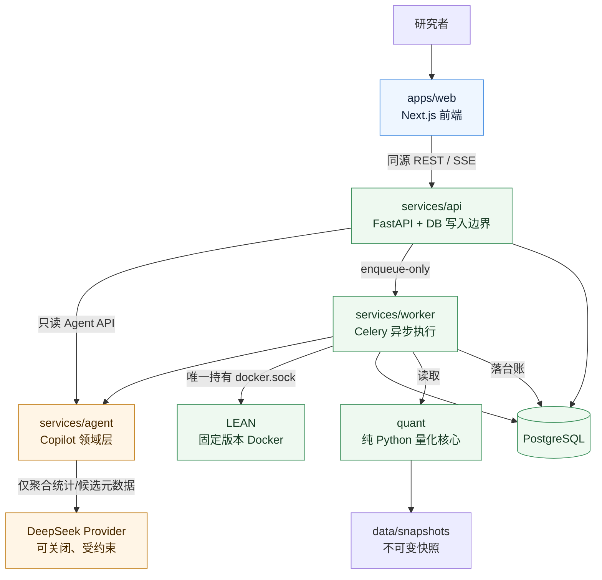

# Axiom Street 项目整理设计

**日期：** 2026-09-07  
**状态：** 已获用户确认，等待实施计划审批  
**范围：** 计划文档收敛、前端/后端/Agent 职责归位、架构文档与验证入口更新

## 目标

把仓库从“按历史工作包堆积”的状态整理为按运行边界和业务职责理解的结构：

- 当前活动计划只保留未完成事项；已完成计划正文删除，Git 历史作为唯一追溯来源。
- 前端、后端运行时和 Agent 领域有清晰的目录归属。
- 保留 API、Worker、量化核心之间已有的部署与依赖隔离。
- Agent 的隐私边界、只读边界和台账写入边界继续由测试锁定。
- README、架构文档、Cursor 规则和计划状态不再互相矛盾。
- 产出一张可维护的 Mermaid 架构图。

## 现状问题

当前仓库的运行边界其实已经存在，但文档和 Agent 代码没有完全反映它：

| 领域 | 当前路径 | 问题 |
|---|---|---|
| 前端 | `apps/web` | 已经是唯一产品前端，但职责主要分散在交接文档和架构文档中 |
| 后端 API | `services/api` | HTTP、数据库和应用服务边界清晰，但 Copilot 领域代码挂在 `services/api/services` 下 |
| 后端异步执行 | `services/worker` | Worker 与 Docker/LEAN 的边界正确，不应与 API 合并为同一运行进程 |
| 量化核心 | `quant` | 应继续保持纯 Python，不依赖 Web/Celery |
| Agent | `services/api/services/copilot`、`services/api/services/suggestions.py`、`services/worker/tasks/copilot.py` | Agent 领域被 API 服务目录和 Worker 任务目录切开，代码归属不直观 |
| 计划 | `docs/PLAN.md` | 包含大量已关闭工作包和历史审计，活动计划难以阅读；README 仍有过时的 Anthropic 文案 |

## 方案

采用“物理归位 Agent、保留运行时边界”的渐进式整理：

```text
apps/web                         前端应用（保留）
services/api                     后端 HTTP + DB 适配（保留）
services/worker                  后端异步任务 + LEAN 编排（保留）
quant                            后端量化核心库（保留）
services/agent                   Agent 领域层（新增）
  copilot/                       只读上下文、Provider、提示词、台账查询
  suggestions.py                 只读确定式建议推导
```

不采用把全部代码物理合并为 `frontend/`、`backend/`、`agent/` 三个顶层目录的方案，因为这会把 API 进程、Worker 进程、Alembic 迁移和纯量化库混成单一目录，降低部署边界的可读性，并扩大导入路径、Docker、CI 和测试改动面。

## 目标架构与依赖方向



依赖规则：

1. `apps/web` 只能通过同源网关/API 契约访问后端，不直接访问数据库、Celery 或 Agent Provider。
2. `services/api/routers` 负责 HTTP 入参、权限/状态校验和 enqueue；不直接调用 LEAN，不直接出站调用模型。
3. `services/worker` 负责异步任务、模型出站调用和台账写入；只有 Worker 可以持有 `docker.sock`。
4. `services/agent` 负责 Agent 领域逻辑。其 API 侧模块只能读聚合事实和台账；模型只能接收聚合统计或白名单候选元数据。
5. `quant` 保持纯 Python，不能 import FastAPI、Celery、SQLAlchemy 或 `services.agent`。
6. Copilot 只能通过 `_record_insight` 与 `_record_suggestion` 写自己的两张台账表；不能修改策略源码、风险限额或验证状态。

## 文件迁移映射

### 新增

- `services/agent/__init__.py`：Agent 领域包入口，不暴露数据库写入接口。
- `services/agent/copilot/__init__.py`：Copilot 只读服务入口。
- `services/agent/copilot/context.py`：从 `services/api/services/copilot/context.py` 迁移。
- `services/agent/copilot/insights.py`：从 `services/api/services/copilot/insights.py` 迁移。
- `services/agent/copilot/prompts.py`：从 `services/api/services/copilot/prompts.py` 迁移。
- `services/agent/copilot/providers.py`：从 `services/api/services/copilot/providers.py` 迁移。
- `services/agent/suggestions.py`：从 `services/api/services/suggestions.py` 迁移。
- `services/agent/README.md`：说明 Agent 输入/输出、隐私边界和运行边界。

### 修改

- `services/api/routers/copilot.py`：改为从 `services.agent` 导入，只保留 HTTP 适配。
- `services/worker/tasks/copilot.py`：改为从 `services.agent` 导入；任务文件继续留在 Worker，因为它是执行入口和台账写入点。
- `services/worker/tasks/__init__.py`：保留现有任务注册和兼容导出，更新模块注释/引用。
- `tests/unit/test_copilot_isolation.py`：扫描目标改为 `services/agent`，继续锁定 API 只读模块、Router、Worker 任务和建议推导。
- `tests/unit/test_copilot_context.py`、`test_copilot_providers.py`、`test_copilot_synthesize.py`、`test_copilot_suggest.py`、`test_suggestions.py`：更新导入路径；行为断言不变。
- `docs/PLAN.md`：替换为当前活动计划，只保留未完成工作与入口规则。
- `docs/architecture.md`：更新仓库布局、分层、Agent 边界和 Mermaid 架构图。
- `docs/frontend-handoff.md`：明确前端只消费 API 契约，Agent UI 属于前端展示层而不是后端目录。
- `README.md`：删除过时的 P5-2 Anthropic 文案，状态只指向 `docs/PLAN.md`。
- `.cursor/rules/axiom-street.mdc`：补充 `services/agent` 目录职责和计划入口说明，不复制状态表。

### 删除

- `services/api/services/copilot/`：代码迁移完成后删除旧目录。
- `services/api/services/suggestions.py`：代码迁移完成后删除旧文件。
- `docs/superpowers/specs/.gitkeep`：仅在规格文档已经存在后删除无意义占位文件。

## 计划文档收敛规则

新的 `docs/PLAN.md` 只包含以下内容：

1. 计划唯一来源声明和阅读顺序。
2. 产品定位与当前阶段的一段简要状态。
3. 当前进行中的工作包和未来未完成工作包。
4. 每个工作包的目标、依赖、交付物和验证命令。
5. 已关闭工作包的短表格，仅记录名称、关闭日期和结果，不保留施工过程、逐次审计和长篇历史叙述。
6. 计划更新纪律：完成一个包后更新状态、README 指针、`.cursor` 指针并执行全仓库残留搜索。

已完成工作包不再在活动计划中展开；不新建归档计划文件。旧版本由 Git 提交历史保留。

## 兼容性与风险控制

- 不改变任何 HTTP 路径、OpenAPI schema、数据库表、Alembic revision、Celery task name 或前端 API 方法。
- 不改变 `services/api/services` 中非 Agent 业务服务的目录结构。
- 不改变 `services/worker/tasks/copilot.py` 的部署路径，避免 Celery 注册名和 Docker 入口发生变化。
- 迁移后必须全仓库搜索旧导入路径，确保无活跃源码、测试或文档引用。
- Agent 隔离测试必须覆盖真实的新目录，否则目录迁移可能造成“测试扫描失效”。

## 验证策略

按风险从小到大执行：

1. `rg` 检查旧路径无活跃引用，检查 README/PLAN/architecture/current scope 状态一致。
2. Agent 隔离测试和全部相关后端单测。
3. 全量 Python 单测、Ruff、Mypy。
4. 前端 TypeScript、Vitest、Lint、生产构建。
5. OpenAPI 生成幂等检查，确认目录迁移没有改变 API 契约。
6. Git diff 检查只发生预期的文件迁移、导入更新、文档收敛和测试路径更新。

## 非目标

- 不新增聊天 UI、不扩展 Agent 能力、不更改模型 Provider 行为。
- 不合并 API 和 Worker 进程。
- 不改变量化计算、验证闸门、风险引擎或数据库 schema。
- 不删除产品愿景、数据源、验证闸门或设计系统文档；只删除活动计划中的已完成施工细节。
